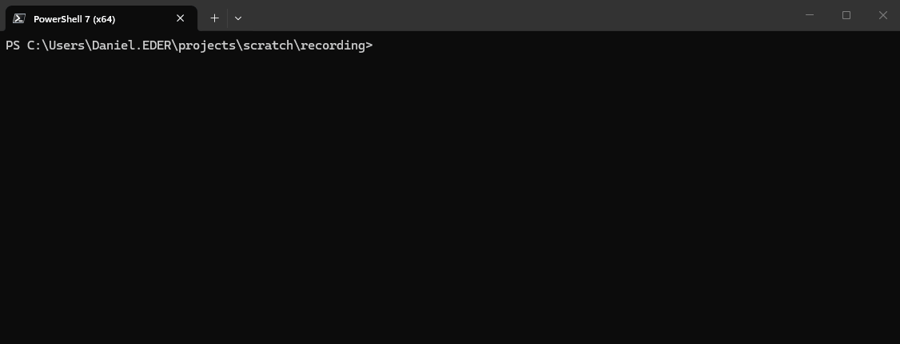

[](LICENSE)
[](https://github.com/lycis/shiori/actions/workflows/build.yml)


<div align="center">


# Shiori

### A tiny personal scribe for thoughts that should not get away.

**Shiori** is a fast, local-first command-line scratchpad and task tracker written in C23.
Capture notes, manage todos, and review a colorful daily dashboard while keeping everything in Markdown files that remain yours.

No database. No account. No cloud. Just plain text.

</div>

<div align="center">
  
</div>

---

## Why Shiori?

Most notes begin as a thought that needs to get out of your head before it disappears:

```console
shiori add --topic development investigate UTF-8 path handling
shiori todo add --due tomorrow prepare release notes "#work"
shiori today
```

For a longer session, stay in a focused capture prompt:

```console
shiori capture --topic planning
```

Shiori keeps the result in ordinary `NOTES.md` and `TODOS.md` files that work with any editor or Markdown tool, including Obsidian.

---

## Features

- 🦊 **Fast capture** — add one thought or collect many in an interactive session.
- 📝 **Plain Markdown** — daily notes and task lists remain readable without Shiori.
- 🪧 **Topics and tags** — organize notes and search related notes and todos together.
- ✅ **Todo workflows** — track status, due dates, tags, and overdue work.
- 🌅 **Daily dashboard** — review a selected day's notes and active tasks.
- ✨ **Friendly terminal UI** — colored output, UTF-8 input, suggestions, and Tab completion.
- 🛡️ **Safe, extensible storage** — guarded file replacement plus local command hooks.
- 🔌 **Obsidian-friendly** — use a vault as `base_dir` without a plugin.

---

## Quick start

Download the `shiori-windows-x64` artifact from a successful GitHub Actions build, extract `shiori.exe`, then run:

```console
.\shiori.exe help
.\shiori.exe init
.\shiori.exe add my first note
.\shiori.exe today
```

`init` creates `.shiori` in the current directory and stores `NOTES.md` and `TODOS.md` there by default.

---

## Build from source

You need GNU Make and a C23-capable compiler; the current supported development setup is Windows with Clang.

```console
make
```

This creates `shiori.exe`. Use `make release` for an optimized, statically linked executable or `make clean` to remove build output.

---

## Commands at a glance

```text
shiori [options] <command> [options] [subcommand] ...
```

| Command | Description |
|---|---|
| `init` | Initialize a `.shiori` configuration. |
| `add` | Add a note to today's section. |
| `capture` | Start an interactive session for rapidly capturing notes and todos. |
| `topic` | Browse notes by topic or list topic statistics. |
| `tag` | Find notes and todos containing all specified tags. |
| `todo` | Add, list, update, and remove todos. |
| `today` | Show notes and active todos in a daily dashboard. |
| `config` | View the loaded configuration. |
| `console` | Start interactive console mode. |
| `help` | Show command help. |
| `version` | Display version and build information. |

Use the global `--debug` option for diagnostic output.

---

## Documentation

- **[User Guide](docs/USER_GUIDE.md)** — installation, configuration, commands, workflows, storage formats, and troubleshooting
- **[Hooks Guide](docs/HOOKS.md)** — hook lifecycle, environment variables, examples, security, and limitations
- **[Contributing](CONTRIBUTING.md)** — development setup and project conventions

---

## Status

Shiori is alpha software, currently Windows-first, and developed with Clang + C23. Linux abstractions exist, but Linux support is incomplete. Current ideas and planned work live in [`IDEAS.md`](IDEAS.md).

The project will stay focused on quick capture rather than becoming a full knowledge-management platform wearing a tiny CLI hat.

---

## Contributing and license

Contributions, bug reports, and ideas are welcome. Shiori is available under the [`MIT License`](LICENSE).

---

<div align="center">

**Write it down. Keep moving.**

🦊

</div>
